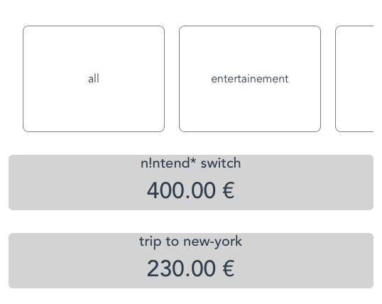

Simple vue 3 app to reproduce a strange warning.

```
[Vue warn]: Avoid app logic that relies on enumerating keys on a component instance. The keys will be empty in production mode to avoid performance overhead.
```

## Screenshot

